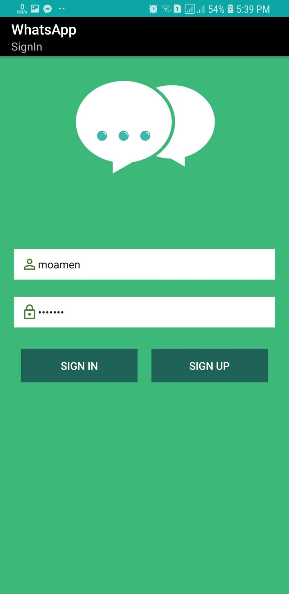
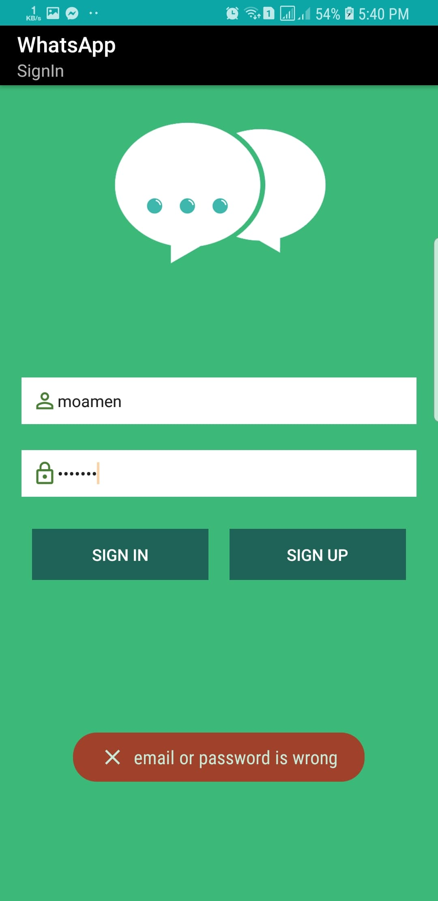
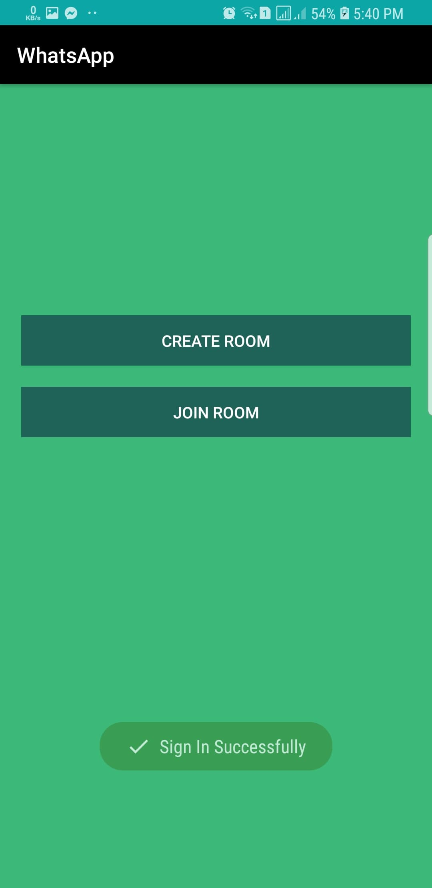
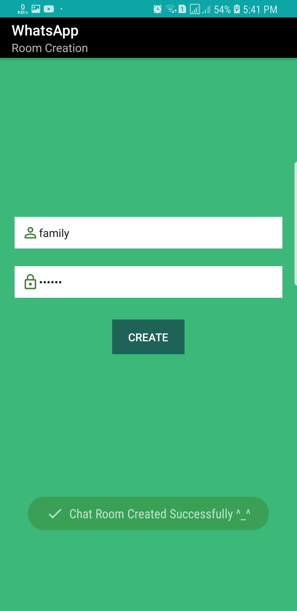
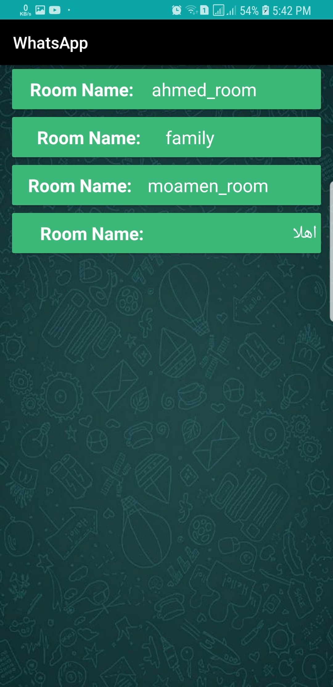
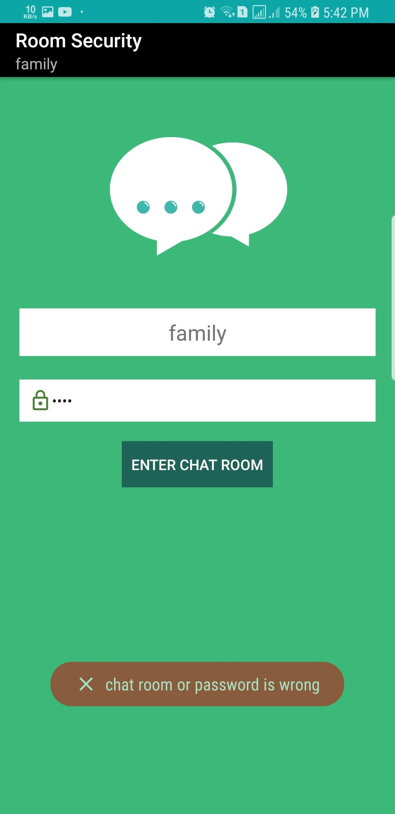
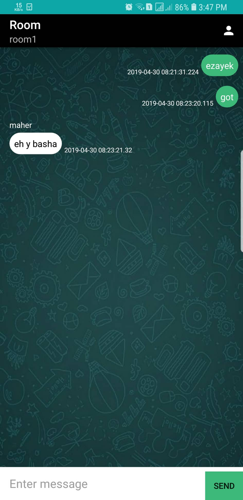
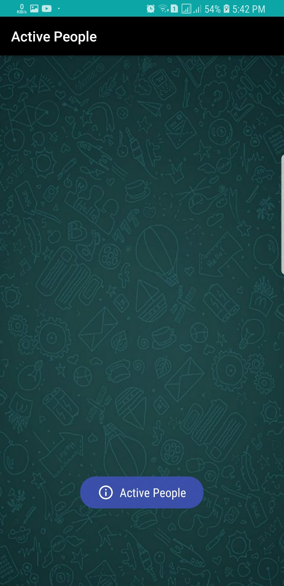

# **Project Idea**

An android application that you can through chat with your friends in secured rooms, chat with your family and make a secure group chat. One creates a chat room and share password to the others to enter the room.

# **App Features**

- **Create-Room**
  - Any user can create a chat room with a specific name and password.
  - The created room will be appended to the current chat rooms.
  - Once the user clicks on the room, he will be directed to authentication page.
- **Security**
  - No one can enter the room without authentication.
- **Ease-of-use**
  - The application is really simple to understand. Once you get into it you will discover everything.
- **Clean-Chat**
  - If you send an insult message. You will be acknowledged that you cannot send that message.
- **Interactive**
  - The application is real time. Once any one sends a message in the chat room, you’ll see it immediately.
  - A new join to the room, you will be notified that {USER} has entered.

# **Programs**

- **Android Studio**
  - Building the client side.
  - Building the client side of socket.io.
  - Connecting to database (FireStore).
- **Visual Studio Code**
  - Building the server side.
  - Writing Readme.
- **GitHub**
  - Creating the repository and keeping track of changes.

# **Programming Languages**

- **Java**
  - Writing the android application (client-side).
- **JavaScript**
  - Writing the server-side.

---

# **Diving into the client-side.**

## **Views**

### **SignIn**

- Activity that takes inputs from the user to log in.
- If they don’t have an account. He can press the button (CreateAccount) to be directed to the SignUp Activity.

### **SignUp**

- Activity that takes inputs from the user to Sign up the user.
- You get success message if your account added to the database.

### **Home**

- Activity the user uses to enter the rooms list or enter create room activity.

### **CreateRoom**

- Activity that takes the room inputs and save it in the database.
- Room inputs are {room_name} and {room_pass}.
- You get success message if your room added to the database.

### **CurrentChatRooms**

- Activity that shows all current rooms exist.
- Once you press on one room, you will be directed to EnterChatRoom to enter the room if you’ve the correct password.

### **EnterChatRoom**

- Authentication Activity to enter the room.

### **ChatRoom**

- Activity contains all message in the group chat
- It has button to direct to the user into ActivePeople Activity to show current online users.

### **ActivePeople**

- Activity that shows the current online users in the room.

## **Models**

- Message
  - A Class holds the information about message { from , text }.
- MessageAdapter
  - To show the messages in the chat room.
- MessageViewHolder
  - The message in the gui.
- Room
  - A Class holds the information about Room { chatRoomID, password, chatList}.
  - A Class holds the information about Room { username, password, email}.
- RoomUser
  - Interface with the server side.
- MessageType
  - Enumeration to make the toast appear with different colors.

## **Controller**

- ### **Connect to database**
  - Connect to firestore database
- ### **SignIn**
  - Takes username and password.
  - Search for the database.
  - If exists and password is correct.
    - Toast sign in successfully.
  - Else
    - Toast wrong username or password.
- ### **SinUp**
  - Takes username, password and email.
  - Add the user into the database.
  - If success
    - Toast Sign up successfully.
  - Else
    - Toast Sign up failed
- ### **AddMessage**
  - Takes the message content and share it to the other online users.
  - Add it to the database.
  - The other online users will get the message and it will be appended to the chat list.
  - Message is updated to the database once.
- ### **AddRoom**
  - Takes the room info { room_name, room_pass }.
  - Add it to the database.
  - If success
    - Toast room created.
  - Else
    - Toast cannot create the room.
- ### **JoinRoom**
  - Takes the room password.
  - Query the database with password and room name.
  - If success
    - Toast Welcome to the room
  - Else
    - Toast Chat Room or Password are wrong.
- ### **LoadRoom**
  - Load the previous chat of the current room.
  - If not success
    - Toast Error Loading.

---

# **Diving into the client-side.**

- ## **Users**
  - ### **addUser**
    - trim user and room
    - check empty
    - check duplicates
    - if nothing occurs
      - store user
    - Else
      - return error
  - ### **getUser**
    - get user by id generated by socket io.
  - ### **removeUser**
    - remove user by id generated by socket.io.
  - ### **getUsersInRoom**
    - get array of users whose room = {room_name}.
- ## **Messages**
  - ### **generateMessage**
    - make the message as object and returns it.

---

# **Server File**

- Runs on port 3000
- Waiting for new connection
- If new connection granted
  - Add the user into the list.
  - Send message to other online users that you have logged in.
  - Send to other online the new list of online users.
  - If you disconnect send message to other online users that you have logged out.
    - Send to other online the new list of online users.
  - If you send an insult.
    - you will be acknowledged with warning message that insults are forbidden.
___

## **Program Scenario**
### **Sign Up**

### **Sign in**

### **Sign in Failed**

### **Sign in Success**

## **Room Creation**

### **Available Rooms**

### **Room Authentication**

### **Chat Room**

### **Active People**

